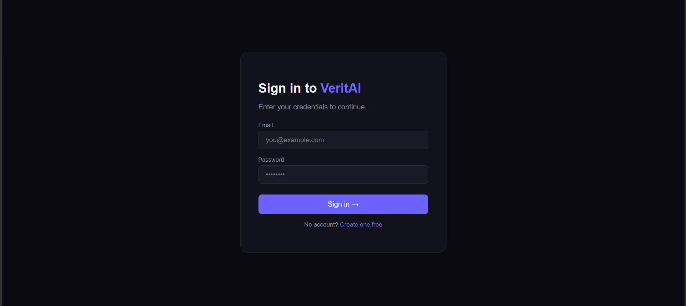
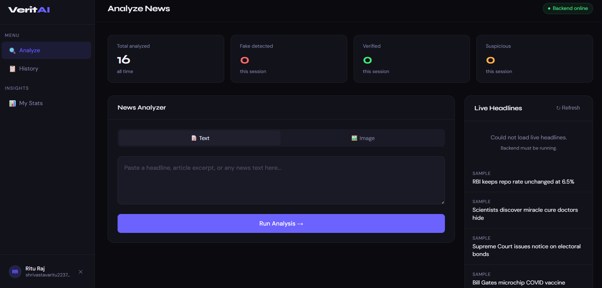
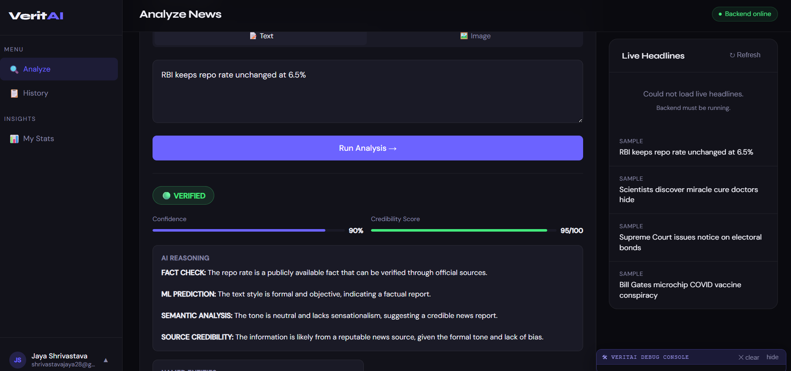

# 🛡️ VeritAI
### AI-Powered Multimodal Fake News Detection System

VeritAI is an AI-powered web application that detects fake news from **text** and **images** using Large Language Models (LLMs). It provides user authentication, news analysis, and an intuitive dashboard for verifying information.

---

## 📸 Project Preview

### 🏠 Home Page


---

### 🔐 Login



---

### 📝 Register


---

### 📊 Dashboard



---

### 🤖 AI Fake News Analysis



---

## ✨ Features

- 🔐 Secure User Authentication
- 🤖 AI-Powered Fake News Detection
- 📰 Live News Feed
- 🖼️ Image-Based Fake News Analysis
- 📊 Modern Dashboard
- ⚡ Fast Flask Backend
- 💾 SQLite Database
- 🌐 REST API Architecture

---

## 🏗️ System Architecture

```
          Frontend (HTML, CSS, JavaScript)
                     │
                     ▼
          Flask Backend (Python)
                     │
     ┌───────────────┼───────────────┐
     ▼               ▼               ▼
 SQLite DB      Groq API      Claude API
```

---

## 🛠️ Tech Stack

### Frontend

- HTML5
- CSS3
- JavaScript

### Backend

- Python
- Flask
- Flask-CORS

### Database

- SQLite

### AI APIs

- Groq
- Anthropic Claude

---

## 📂 Project Structure

```
VeritAI
│
├── backend
│   ├── routes
│   ├── services
│   ├── app.py
│   ├── db.py
│   └── requirements.txt
│
├── frontend
│   ├── css
│   ├── js
│   ├── index.html
│   ├── login.html
│   ├── register.html
│   └── dashboard.html
│
├── screenshots
│
├── README.md
└── .gitignore
```

---

## 🚀 Installation

### Clone Repository

```bash
git clone https://github.com/Rituraj-24/VeritAI.git
```

### Go to Project

```bash
cd VeritAI/backend
```

### Create Virtual Environment

```bash
python -m venv venv
```

### Activate Virtual Environment

Windows

```bash
venv\Scripts\activate
```

### Install Dependencies

```bash
pip install -r requirements.txt
```

### Run Backend

```bash
python app.py
```

Open the frontend using **Live Server** and start from:

```
frontend/index.html
```

---

## 🎯 Future Improvements

- Admin Dashboard
- Email Verification
- User Profile
- Mobile Responsive UI

---

## 👨‍💻 Developer

**Ritu Shrivastava**

GitHub: https://github.com/Rituraj-24

---

## ⭐ If you like this project

Give this repository a ⭐ on GitHub.
